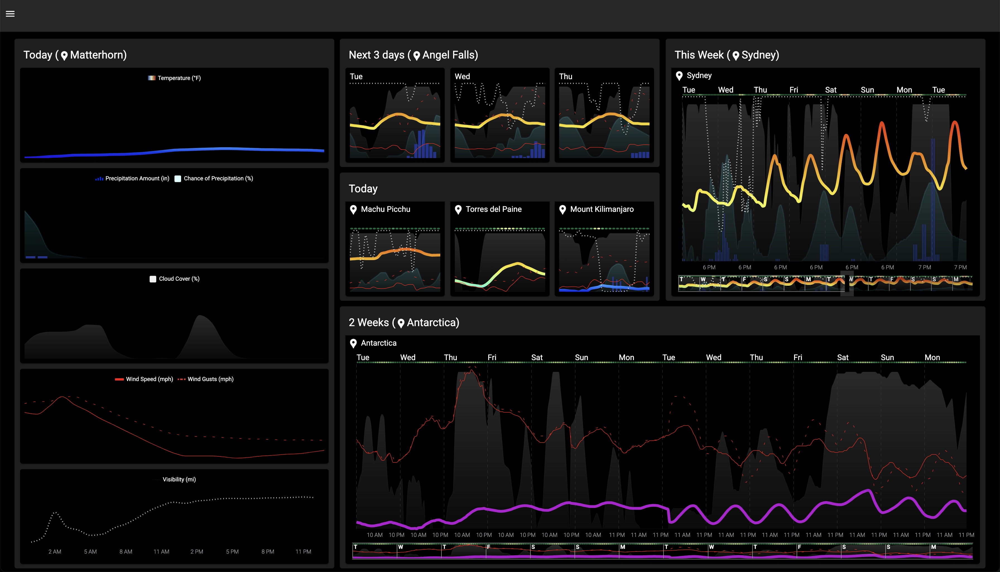

# Clear

Clear is a customizable weather dashboard, enabling users to quickly and easily see the weather that they care about, in a way that is intuitive to them.

**Live Deployment**: https://clear-sepia.vercel.app/

---

---
## Features
### Pages
Each page contains a customizable layout of user-created sections and cards that display hourly weather forecast information.

### Graphs
- **Add, delete, move, and resize sections and cards **
	- A nested 12-column grid layout of cards within sections
	- Drag and drop resizing and movement for both
- **Display any number of parameters on 1 chart:**
	- Temperature
	- Chance of Precipitation
	- Precipitation Amount
	- Cloud Cover
	- Visibility
	- Wind Speed
	- Wind Gusts
	- UV Index
- **Select the forecast range:**
	- Choose to display any range of hourly data within the next 2 weeks, e.g.
		- Today (hours 0 - 23)
		- Tomorrow (hours 24 - 48)
		- Tomorrow only while I'm awake (hours 6 - 22)
		- The next 3 days (hours 0 - 72)
		- The next 14 days (hours 0 - 336)
- **Customize graph display:** by toggling visibility of:
	- Hourly labels
	- Location labels
	- Day reference lines
	- Legend
	- Forecast range selection slider
- **Cascading location selection:**
	- See weather for any number of locations on a single page
	- Set location for the entire Page, a Section, or a single Card
	- Location gets inherited automatically, unless an override is set

---
## Technologies, Libraries, APIs
- HTML
- CSS
- Tailwind
- JavaScript
- React
- Redux
- Redux Toolkit
- React-grid-layout
- MUI, MUI x-charts
- Open-meteo

---

## Possible Future Features
- Save layout
- Accounts